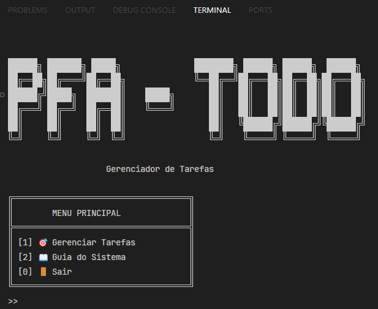
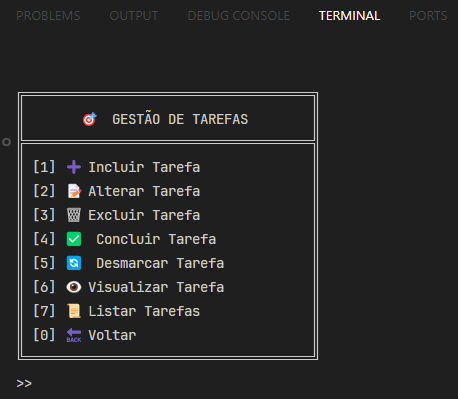
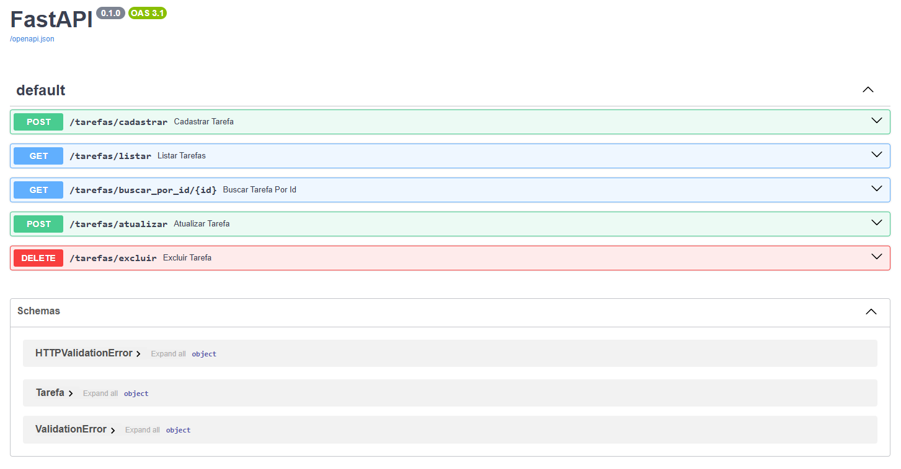

# 🎯 PFA - ToDo

Um sistema completo desenvolvido em Python, que permite o gerenciamento eficiente de tarefas.

## 📋 Funcionalidades

### 🎯 Gestão de Tarefas
- **Cadastro**: Cadastro de tarefas
- **Alteração**: Alterar tarefas
- **Exclusão**: Excluir tarefas
- **Visualização**: Visualizar tarefas
- **Concluir / Desmarcar**: Concluir / Desmarcar uma tarefa específica

## 🛠️ Tecnologias Utilizadas

- Python 3.13.3
- FastAPI
- Questionary (interface de usuário)
- JSON (armazenamento de dados)

## 📦 Instalação

1. Clone o repositório:
```bash
git clone https://github.com/andreLopes41/ToDo
```

2. Instale as dependências:
```bash
pip install -r requirements.txt
```

3. Inicie o servidor do FastAPI:
```bash
fastapi dev .\api\todo_api.py
```

4. Execute o sistema:
```bash
python view/main.py
```

## 🎯 Estrutura do Projeto

```
todo/
├── api/         # API do projeto com FastAPI 
│   └── todo_api.py
├── controller/         # Controlador 
│   └── tarefa_controller.py
├── model/             # Modelo de dados
│   └── Tarefa.py
├── repository/        # Camada de persistência de dados
│   └── tarefa_repository.py
├── view/             # Interface do usuário
│   └── main.py      
├── json/            # Armazenamento de dados em arquivos JSON
│   └── tarefa.json
├── requirements.txt  # Dependências do projeto
└── README.md        # Documentação
```

### 📁 Descrição dos Diretórios

#### Api
Define os endpoints da API e faz validações da request feita pelo controlador.  

#### Controller
Contém a lógica de negócio da aplicação, implementando as regras de validação e controle de tarefas.

#### Model
Define as estruturas de dados e entidades do sistema usando o Pydantic.

#### Repository
Responsável pela persistência dos dados, implementando operações CRUD para as tarefas.

#### View
Interface do usuário em modo texto, utilizando menus interativos.

#### JSON
Armazena os dados da aplicação em arquivos JSON.

## 🔄 Padrões de Projeto Utilizados

- **MVC (Model-View-Controller)**: Separa a aplicação em três camadas distintas
- **Repository Pattern**: Abstrai a camada de persistência de dados
- **Singleton**: Utilizado nos repositórios para garantir única instância

## 🔒 Regras de Negócio

1. **Tarefas**
   - Nome e descrição são obrigatórios no cadastro de uma nova tarefa
   - A data de criação de uma tarefa é gerada automaticamente pelo sistema
   - Alteração, Exclusão e Visualização de tarefas são feitas pelo id da tarefa
   - Uma tarefa concluída não pode ser concluída duas vezes

## 🔍 Funcionalidades Principais

### Cadastro de Tarefas
```python
def cadastrar_tarefa(self, nome, descricao):
    # Validações
    # Comunicação com o endpoint da API
    # Persistência em JSON
```

## 🖼️ Interface do Sistema

### Menu Principal



### Gestão de Tarefas


### Interface Swagger
